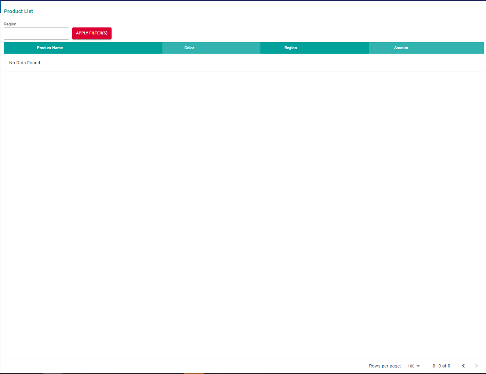

## JAYA AGUNG TEKNOLOGI

Kerjakan dengan cara yang menurut anda paling efisien, yang menghasilkan user experience dan perfomance yang terbaik.

### 1. Konversi object dibawah untuk mendapat hasil yang diinginkan tanpa assign ke variabel baru

initial data: 

```js
const selectedRegion = "eu";
const initialData=[{id:1,name:"sepatu",variant:[{id:1,color:"red",pricing:[{region:"id",amount:3e4},{region:"eu",amount:20}]}]},{id:2,name:"baju",variant:[{id:2,color:"yellow",pricing:[{region:"id",amount:5e4},{region:"eu",amount:30}]},{id:6,color:"more yellow",pricing:[{region:"id",amount:55e3},{region:"eu",amount:32}]},{id:7,color:"most yellow",pricing:[{region:"id",amount:5e5},{region:"eu",amount:350}]}]},{id:3,name:"celana",variant:[{id:3,color:"blue",pricing:[{region:"id",amount:4e4},{region:"eu",amount:25}]},{id:4,color:"white",pricing:[{region:"id",amount:8e4},{region:"eu",amount:60}]}]}];

// your code here

// result : [{amount:20,color:"red",name:"sepatu",region:"eu"},{amount:30,color:"yellow",name:"baju",region:"eu"},{amount:32,color:"more yellow",name:"baju",region:"eu"},{amount:350,color:"most yellow",name:"baju",region:"eu"},{amount:25,color:"blue",name:"celana",region:"eu"},{amount:60,color:"white",name:"celana",region:"eu"}];
```


### 2. Buatlah react component dengan kriteria berikut:
- Gunakan react fc, typescript dan mui (material ui v5)
- Tabel yang menampilkan data hasil konversi diatas 
- Text field untuk selectedRegion
- Tombol filter (tombol untuk mengubah selectedRegion menjadi id/eu/semua sesuai dengan input di text field)
- Customize tabel agar sesuai dengan gambar dibawah

